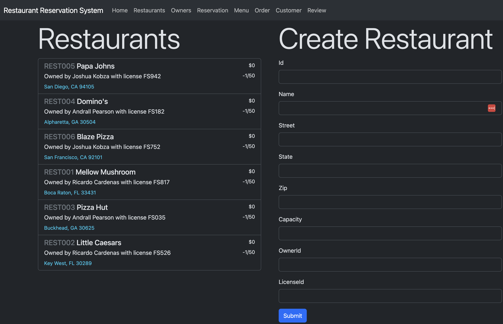

# Restaurant Reservation System
_Project for CS 2340 Objects & Design_

Group members: Bryce Hanna, Vivian Gu, Logan Tao, Korina Goldsmith, and Varun Warrier_

## Quickstart
Open the project in Intellij and either use one of two preconfigured run options: CLI or Web. The former will allow you to enter commands in the format provided for the testing phases of the project, and the latter gives you a nice web interface to go through. 

## Problem Description
The requirements for the project can be found [in the assets folder](assets/requirements.pdf)

